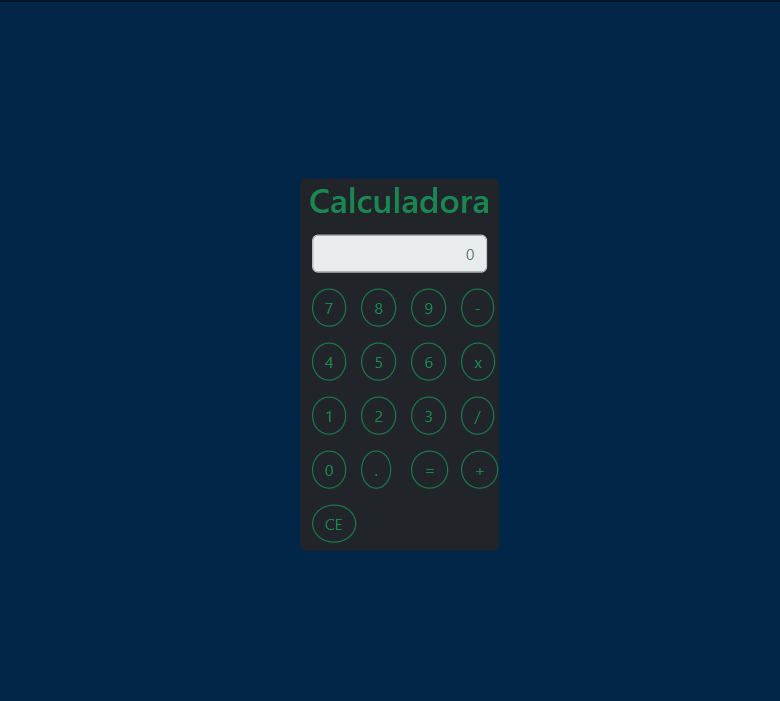
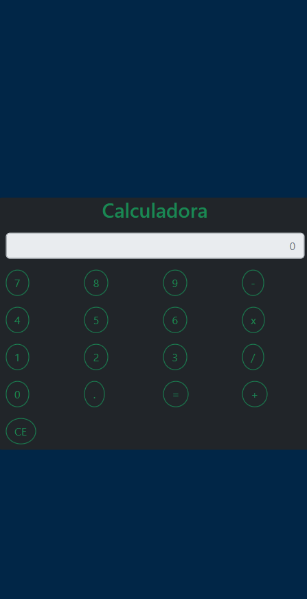

<h1 align="center">Calculadora</h1>

<h3 align="center">Calculadora Responsiva para o curso DevTiSul</h3>

 

  

    
<strong>Imagens</strong>

     
    

    
    

    
    

    
    

 

  <h3>Tecnologias utilizadas</h3>
  
HTML, JS, Bootstrap,Git e Github

